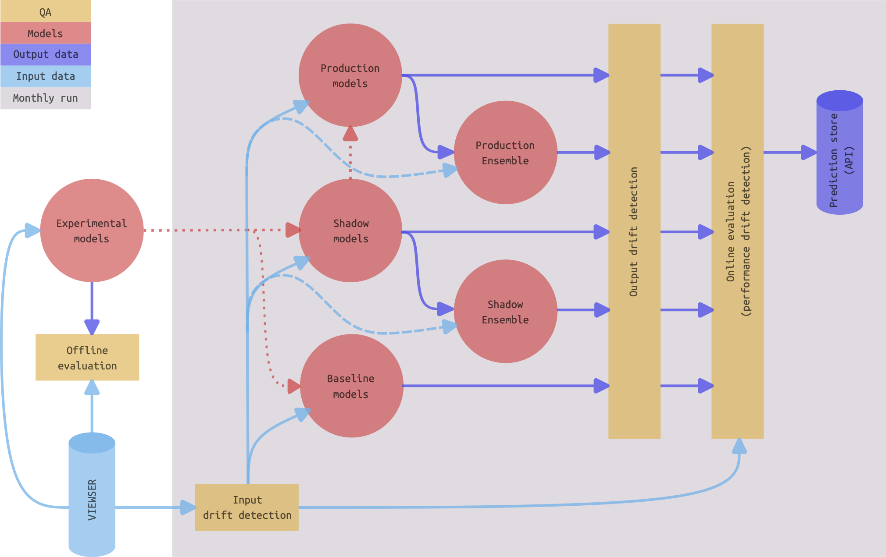

# views_pipeline

<div style="width: 100%; max-width: 1500px; height: 400px; overflow: hidden; position: relative;">
  
</div>

The [**Violence & Impacts Early Warning System (VIEWS)**](https://viewsforecasting.org/) produces monthly predictions of future violent conflict at both a country and sub-country level of analysis. This repository contains code, configuration files, and documentation that encapsulates the entire process of developing, experimenting, training, evaluating, and deploying the VIEWS machine learning model pipeline.

Use our [interactive data dashboard](https://data.viewsforecasting.org/) to explore our latest predictions of future armed conflict.

> [!CAUTION]
> Please note that this pipeline is **actively under construction**. We're in the **early stages of development**, meaning it's **not yet ready for operational use**. We're working hard to bring you a robust and fully-functional tool, so stay tuned for updates!

## Table of contents

<!-- toc -->
- [Repository Contents, Structure, and Explanations](#repository-contents-structure-and-explanations)
- [Pipeline Execution](#pipeline-execution)
- [Pipeline Documentation](#pipeline-documentation)
- [About the VIEWS Project](#about-the-views-project)


<!-- tocstop -->


## Repository Contents, Structure, and Explanations


### Repository Contents

This repository includes:

- **Code:** Source code for the VIEWS project's machine learning models and the full pipeline.
- **Configuration Files:** Settings and configurations for running the models, ensembles, and orchestration scripts.
- **Documentation:** Detailed instructions and information about the project and how to interact with the pipeline and the individual components.

### Pipeline Overview

The VIEWS machine learning pipeline involves several key processes:

- **Developing:** Creating and refining machine learning models.
- **Experimentation:** Testing and validating various model configurations and approaches.
- **Training:** Training models with relevant data.
- **Evaluating:** Assessing model performance and accuracy.
- **Deploying:** Implementing models in a production environment to generate monthly true-future forecasts 

Each model is contained within its own sub-folder, providing a modular structure for development and deployment.

<details>
  <summary> <b>Toggle to see the model repository structure and explanations below. </b></summary>

```
pipeline_root/
|
|-- README.md                                       # What you are looking at
|-- LICENSE.md                                      # Creative commons (CC BY-NC-SA 4.0)
|-- .gitignore                                      # In place to ensure no unwanted file types get pushed to GitHub
|
|-- orchestration/                                  # Orchestration for the entire pipeline (runs all deployed models and ensembles via Prefect)
|   |-- orchestration.py                            # Source code for orchestration
|   |-- README.md                                   # Instructions for orchestration
|
|-- common_configs/                                 # Configurations files common to all (or multiple) models or the larger pipeline
|   |   ...
|
|-- common_utils/                                   # Functions and classes used across multiple (but not necessarily all) models/ensembles  
|   |   ...
|
|-- documentation/                                  # High-level documentation of pipeline
|   |   ...
|
|-- meta_tools/                                     # Scripts to add new models and check structure and presence of obligatory scripts
|
|-- models/                                         # Parent directory for all individual models (see documentation for definition of "model")
|   |-- exemplifying_model/                         # Each individual model subdirectory should follow the naming convention adjective_noun
|   |   |
|   |   |-- README.md                               # Concise description of the model and relevant details written in "plain language"
|   |   |-- requirements.txt                        # Python version and libraries - should rarely deviate from a standard well-maintained VIEWS_env
|   |   |-- main.py                                 # Orchestration script to run the model
|   |   |
|   |   |-- configs/                                # All model specific config files
|   |   |   |-- config_deployment.py                # Controls deployment settings and model behavior in different environments
|   |   |   |-- config_hyperparameters.py           # Specifies the finalized hyperparameters used for training the model
|   |   |   |-- config_input_data.py                # Defines the features to be pulled from the views and used - basically the queryset
|   |   |   |-- config_meta.py                      # Provides metadata about the model, such as algorithm and creator for documentation purposes
|   |   |   |-- config_sweep.py                     # Defines how to perform hyperparameter sweeps for optimization during experimentation phase

|   |   |
|   |   |-- data/                                   # All input, processed, output data (only saved locally, not pushed to git)
|   |   |    |-- raw/                               # Data directly from VIEWSER
|   |   |    |-- processed/                         # Data processed
|   |   |    |-- generated/                         # Data generated - i.e., predictions/forecast
|   |   |
|   |   |-- artifacts/                              # Model artifacts (only saved locally). Step-shift models will have 36 of each. pth or pkl.
|   |   |   |-- evaluation_metrics.py               # A dictionary containing the evaluation metrics for all 36 steps found in the test partition
|   |   |   |-- model_calibration_partition.pth     # Model object for offline evaluation, trained on train set of calibration partition
|   |   |   |-- model_test_partition.pth            # Model object for offline evaluation, trained on train set of the test partition
|   |   |   |-- model_forecasting.pth               # Model object for online forecasting, trained on the forecasting partition
|   |   |
|   |   |-- notebooks/                              # Only for development experimentation, and trouble-shooting.
|   |   |
|   |   |-- reports/                                # Dissemination material - internal and external
|   |   |   |-- plots/                              # Plots for papers, reports, newsletters, and slides
|   |   |   |-- figures/                            # Figures for papers, reports, newsletters, and slides
|   |   |   |-- timelapse/                          # Plots to create timelapse and the timelapse
|   |   |   |-- papers/                             # Working papers, white papers, articles etc.
|   |   |   |-- slides/                             # Slides, presentation, and similar
|   |   |
|   |   |-- src/                                    # All source code needed to train, test, and forecast
|   |       |
|   |       |-- dataloaders/                        # Model specific scripts to get data from VIEWSER (input drift detection happens here)
|   |       |   |-- get_calibration_data.py         # The model specific data covering the standard calibration partition
|   |       |   |-- get_test_data.py                # The model specific data covering the standard test partition
|   |       |   |-- get_forecasting_data.py         # The model specific data for forecasting during deployment - first observed month to last observed month
|   |       |
|   |       |-- architectures/                      # Only relevant for models developed in-house
|   |       |   |-- network.py                      # E.g., a py script containing a PyTorch nn class
|   |       |
|   |       |-- utils/                              # Model sepcific Functions and classes (common utils should be in the common_utils in root)
|   |       |   |-- utils.py                        # A general utils.py for all utils function
|   |       |   |-- utils_torch.py                  # Sep. utils demanding more specific libraries
|   |       |   |-- utils_gpd.py                    # Sep. utils demanding more specific libraries
|   |       |
|   |       |-- visualization/                      # Scripts to create visualizations
|   |       |
|   |       |-- training/
|   |       |   |-- train_calibration_model.py      # Script for training the model on train set of the calibration partition  
|   |       |   |-- train_testing_model.py          # Script for training the model on the train set of the test partition
|   |       |   |-- train_forecasting_model.py      # Script for training the model on the full forecasting partition
|   |       |
|   |       |-- offline_evaluation/                 # Offline evaluation and quality assurance
|   |       |   |-- evaluate_model.py               # Script to evaluate a trained and saved model - can be calibration or test
|   |       |   |-- evaluate_sweep.py               # Script to run a wandb sweep - should only ever be used on the calibration partition
|   |       |
|   |       |-- online_evaluation/
|   |       |   |-- evaluate_forecast.py            # Continuous performance check of the deployed forecasting model (W&B Specific)
|   |       |
|   |       |-- forecasting/
|   |           |-- generate_forecast.py            # Script to generate true-future forecasts.
|   |
|   |-- different_model/                            # Next model, similar structure
|   |   |-- ...
|   |   ...
|   ...
|
|-- ensembles/
|   |-- exemplifying_ensemble/                      # Similar to model dir, with a few differences
|   |   |-- README.md                               # Concise description of the ensemble and relevant details written in "plain language"
|   |   |-- requirements.txt
|   |   |-- main.py                                 # Orchestration script to run a deployed ensemble as part of a full run via Prefect on a monthly basis
|   |   |
|   |   |-- configs/                                # All ensemble specific config files
|   |   |   |-- config_ensemble.py                  # Contains ensemble architecture, name, target variable, level of analysis and deployment status
|   |   |   |-- config_hyperparameters.py           # If applicable, specifies the finalized hyperparameters of the ensemble (W&B specific)
|   |   |   |-- config_sweep.py                     # If applicable, specifies the hyperparameter sweeps during experimentation phases (W&B specific)
|   |   |
|   |   |-- artifacts/                              # Ensemble's artifacts. Not applicable to all ensembles
|   |   |
|   |   |-- notebooks/                              # Only for development experimentation, and trouble-shooting.
|   |   |
|   |   |-- reports/                                # Dissemination material - internal and external
|   |   |   |-- ...                              
|   |   |
|   |   |-- src/                                    # All source code needed to train, test, and forecast
|   |       |
|   |       |-- dataloaders/                        # In most cases, ensembles will only take outputs from other models as input
|   |       |   |-- get_data.py                     # Get outputs from individual models instead of VIEWSER data
|   |       |
|   |       |-- architecture/                       # Some ensembles might have an architecture
|   |       |   |-- ensemble.py                     # Script for said architecture
|   |       |
|   |       |-- utils/                              # Ensemble specific utils
|   |       |   |-- utils.py                        
|   |       |   
|   |       |-- visualization/                      # Scripts to create visualizations
|   |       |
|   |       |-- training/                           # Some ensembles might need training
|   |       |   |-- train_ensemble.py               # Script for such potential training
|   |       |
|   |       |-- offline_evaluation/                 # Offline evaluation and quality assurance
|   |       |   |-- evaluate_ensemble.py            # Script to evaluate an ensemble - can be used with calibration or test models
|   |       |   |-- evaluate_sweep.py               # Script to run a wandb sweep - should only ever be used with the calibration partition
|   |       |
|   |       |-- online_evaluation/
|   |       |   |-- evaluate_forecast.py            # Continuous performance check of the deployed forecasting ensemble (W&B Specific)
|   |       |
|   |       |-- forecasting/
|   |           |-- generate_forecast.py            # Script to generate true-future forecasts
|   |       
|   |
|   |-- different_ensemble/                         # Next ensemble, similar structure
|   |   |-- ...
|   |   ...
|   ...
|

```
</details>


## Pipeline Documentation
High-level documentation on the pipeline and its components can be found in the folder [`documentation`](https://github.com/prio-data/views_pipeline/tree/main/documentation). For a comprehensive understanding of the terms and concepts used, please consult the [`Glossary`](https://github.com/prio-data/views_pipeline/blob/main/documentation/glossary.md). To explore the rationale behind our architectural choices, visit the [`Architectural Decision Records (ADRs)`](https://github.com/prio-data/views_pipeline/blob/main/documentation/ADRs/README.md).

Additionally, refer to READMEs and docstrings of various functions and classes in the source code.

The operational fatalities model generates forecasts for state-based armed conflict during each month in a rolling 3-year window. 
The latest iteration, currently in production, is called [Fatalities002](https://viewsforecasting.org/early-warning-system/models/fatalities002/).

The following links cover **modelling documentation** for Fatalities002:
- [Prediction models and input variables in main ensemble](https://viewsforecasting.org/views_documentation_models_fatalities002/)
- [Levels of analysis and dependent variables](https://viewsforecasting.org/wp-content/uploads/VIEWS_documentation_LevelsandOutcomes.pdf)
- [Partitioning and time shifting data for training, calibration, testing/forecasting, model weighting, and out-of-sample evaluation](https://viewsforecasting.org/wp-content/uploads/VIEWS_Documentation_Partitioningandtimeshifting_Fatalities002.pdf)
- [Ensembling and calibration](https://viewsforecasting.org/wp-content/uploads/VIEWS_documentation_Ensembling_Fatalities002.pdf)

For VIEWS-specific **infrastructure documentation**, please refer to following GitHub repositories:
- [`ingester3`: Loading input data into the views database](https://github.com/UppsalaConflictDataProgram/ingester3)
- [`viewser`: Accessing input data from views database](https://github.com/prio-data/viewser)
- [`views_api`: Our API for accessing predictions](https://github.com/prio-data/views_api)

## About the VIEWS Project

The VIEWS project is a collaborative effort supported by leading research institutions focused on peace and conflict studies. For more information about the project, visit the [VIEWS Forecasting webpage](https://viewsforecasting.org/).

### Affiliations

- **Peace Research Institute Oslo (PRIO):**
  The [Peace Research Institute Oslo (PRIO)](https://www.prio.org/) conducts research on the conditions for peaceful relations between states, groups, and people. PRIO is dedicated to understanding the processes that lead to violence and those that create sustainable peace. About half of the VIEWS core team is currently located at PRIO.

- **Department of Peace and Conflict Research at the University of Uppsala:**
  The [Department of Peace and Conflict Research at the University of Uppsala](https://www.uu.se/en/department/peace-and-conflict-research) is a leading academic institution in the study of conflict resolution, peacebuilding, and security. The department is renowned for its research and education programs aimed at fostering a deeper understanding of conflict dynamics and peace processes. This department also hosts the [Uppsala Conflict Data Program (UCDP)](https://ucdp.uu.se/), a central data source for the VIEWS project. About half of the VIEWS core team is currently located at the University of Uppsala.