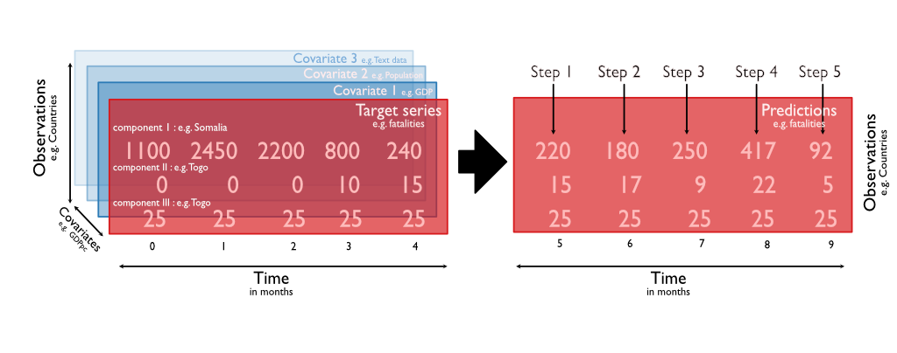
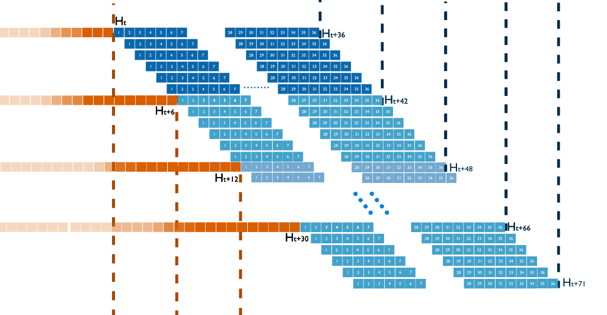
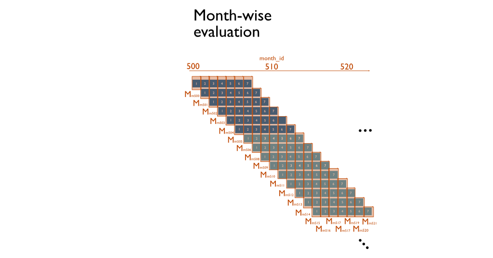
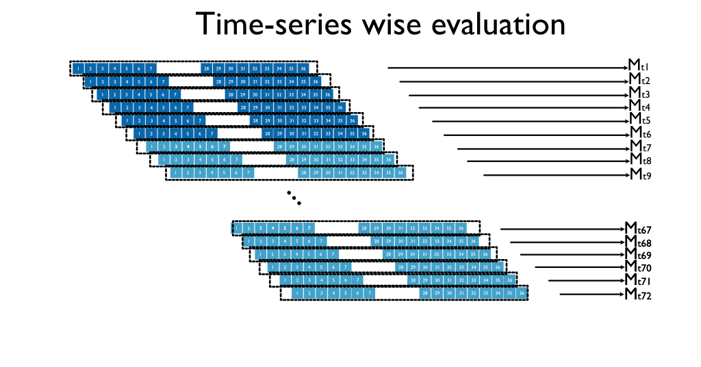
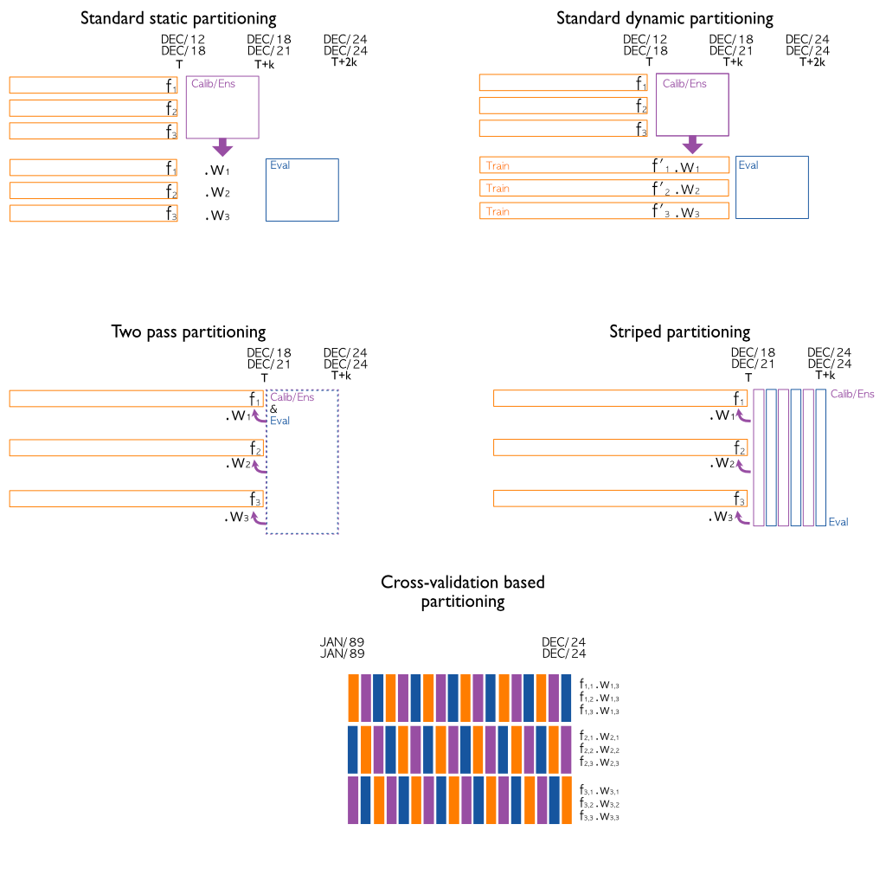

# Evaluation routines
Proposal

The main output of *VIEWS* is a panel of forecasts. These consist of a set of temporal sequences, one temporal sequence for each observation at the corresponding level of analysis (*LOA*). Each sequence contains forecasts for every month in the *forecasting window*. For those readers more familiar with econometric time-series forecasting, in formal terms, each VIEWS model produces a multiple time-series, with each component being the predicted time-series for a spatial observation. In plain terms, for each country, PRIOGrid or actor, for each month, there is one forecast (which can be a value, e.g. predicted number of fatalities, a probability, e.g. the probability of an onset, a set of quantiles, e.g. the 10th, 50th and 90th percentile of forecast fatalities, or a vector of samples - e.g. 1000 draws of predicted fatalities).

The machine learning models generating these predictions are trained, at the very least, on a similar multiple time-series containing the same outcome as the target prediction, at a different, past, and known point in time - this is referred to in econometric forecasting literature as the *target series*, and in past VIEWS papers as the *conflict history*. These may be supplemented by one or more (up to infinity) series of covariates - thus making the problem that VIEWS addresses one of *multiple and multivariate time series forecasting*.  If the value of these co-variates can be known ahead of time for the entire prediction window (e.g. dates of Catholic Easter, dates of Ramadan, election dates), these covariates are called *future features* (or *future covariates* in TS literature). If these are only known for the training data, these are known as *shifted features* or *past covariates*. 

A diagram of how this all works for a simple toy example with three observations and five temporal points is described in the figure below:

There is a plethora of models that are able to take in inputs and produce outputs that conform to the approach above. Some, such as *step-shifter* (or *direct-multistep forecasting* in econometric literature) are manipulating both the co-variate and target timeseries by repeatidly realigning predictors and outcomes in such a way as to extract relationships that exist between predictors and targets across multiple timespans. Others, such as *dynasim* are recursively predicting the next time step and using the value from that time step as predictors for the next time step in the predictions temporal sequence. Others such as *decomposition models* dissect the time-series into components that can be parametrized and apply the parametrized component ensemble to predict future time steps. Irrespective of the approach, a core paradigm of the VIEWS system is that, while VIEWS provides helper tools and utilities, **the modelling approach is left to the latitude of each model and modeller**, both in terms of fundamental paradigm and implementation. For our purpose, this has an essential consequence: **all evaluation routines and metrics are model- and paradigm- agnostic**. This means that they cannot depend on how a model is architected and trained, but only on the general panel prediction architecture described above.

# Evaluation

For the purpose of exemplification, in all diagrams, a univariate time series (i.e. a single PRIOGrid cell or a single country) will be illustrated. However, all requirements, metrics and approaches described below will work identically irrespectively of whether applied to a single or a multitude or observations (time-series).

## Points of Definition: 

1. *Time*: All time points and horizons mentioned below are in  **outcome space**, also known as $Y$-space : this means that they refer to the time point of the (forecasted or observed) outcome. This is especially important for such models where the feature-space and outcome-space are shifted and refer to different time points.

2. *Temporal resolution*: The temporal resolution of VIEWS is the calendar-month. These are referred in VIEWS by an ordinal (Julian) month identifier (`month_id`) which is a serial numeric identifier with a reference epoch (month 0) of December 1979. For control purposes, January 2024 is month 529. VIEWS does not define behavior and does not have the ability to store data prior to the reference epoch (with negative `month_id`). Conflict history data, which marks the earliest possible meaningful start of the training time-series, is available from `month_id==109`.

3. *Forecasting Steps* (further referred to as steps) is defined as the 1-indexed number of months from the start of a forecast time-series.

## General Evaluation Strategy:

The general evaluation strategy involves *training* one model on a time-series that goes up to the training horizon $H_0$. This sequence is then used to predict a number of sequences (time-series). The first such sequence goes from $H_0+1$ to $H0+36$, thus containing 36 forecasted values -- i.e. 36 months. The next one goes from $H_0+2$ to $H_0+37$. This is repeated until we reach a constant stop-point $k$ such that the last sequence forecasted is $H_0+k+1$ to $H_0+k+36$. 

Normally, it is up to the modeller whether the model performs *expanding window* or *rolling window* evaluation, since *how* prediction is carried out all evaluations are of the *expanding window forecasting* type, i.e. the training window. 

### Live evaluation

For **live** evaluation, we suggest doing this in the same way as has been done for VIEWS2020/FCDO (_confirm with HH and/or Mike_), i.e. predict to k=12, resulting in *12* time series over a prediction window of *48* months. We call this the evaluation partition end $H_{e,live}$. This gives a prediction horizon of 48 months, thus $H_47$ in our notation.

### Offline evaluation

For **offline** model evaluation, we suggest doing this in a way that simulates production over a longer time-span. For this, a new model is trained at every six months interval, thus resetting $H_0$ at months $H_0+0, H_0+6, H_0+12, \dots H_0+6r where 6r=H_e$.

We propose the following practical approaches:

1. A **standard** evaluation will be the default we set $H_{e_eval}$ to 48 months, meaning there will be *2* retrainings, at $H_0, H_6$ and *12* predicted time-series.

2. A **long** evaluation where we set  $H_{e_eval}$ to 72 months, meaning there will be *6* retrainings, at $H_0, H_6, H_12, H_18, H_24, H_30$. This will result in *36* predicted time-series.
   
3. Finally, we propose a **complete** evaluation system, the longest one, where we set $H_0$ at 36 months of data (157 for models depending on UCDP GED), and iterate until the end of data (currently, the final $H_0$ will be 529).

For comparability and abstraction of seasonality (which is inherent in both the DGP as well as the conflict data we rely on, due to their definition), $H_0$ should always be December or June (this also adds convenience).

The three approaches have trade-offs besides increasing computational complexity.  Since conflict is not a stationary process, evaluation carried for long time-periods will prefer models that predict whatever stationary components exist in the DGP (and thus in the time-series). For example these may include salient factors such GDP, HDI, infant mortality etc.. Evaluation on such very long time-spans may substantially penalize models that predict more current event, due shorter term causes that were not so salient in the past. Examples of these may be the change in the taboo on inter-state war after 2014 and 2022 with Russia invading Ukraine.

## Calculation of metrics:

**All metrics are specified in a separate document.**. 

Since we are handling time series data, aggregating metrics must be done in terms of sequences. There are three ways of doing so, all with potential advantages. 

1. The first is evaluating *along the sequence*. For each 36-month time-series, predictions are computed, and a metric (MSE) is compared against the actuals over the entire time-series (i.e. for the 36 months). This shows *how good the predictive power of the time-series is on average against the actuals*. This will result in 12 computed values for the *live* and *standard* offline evaluation, 36 for the *long* and a variable number, currently *342* for the complete evaluation. These can be averaged, CIs computed etc. This is the standard approach done in most machine learning for time-series methods, and is what packages like _darts_ or _prophet_ normally provide. This method also allows for some extra metrics that cannot be implemented in other evaluation approaches -- such as tests for Granger causality or Sinkhorn distances to evaluate whether we overshoot or undeshoot temporally the dynamics of conflict.

2. The second is the standard approach computed in VIEWS, VIEWS2020 and FCDO, and the standard employed for ALL the existing systems. This approach entails taking the predictions and actuals from each step from each model output. These are then assembled and aligned to create, for each step, a sequence. This sequence is then used to compute a metric valid for that respective step. The purpose of this is to verify which models predict best closest to the training horizon (thus have short-term predictive power), and which do best further along the prediction axis (thus have long-term predictive power). Therefore, irrespective of approach used, this will result in 36 such stepwise metrics (one for step 1, one for step 2, one for step 3).

3. The third and final approach entails collecting all predictions for a given calendar month in their own respective sequences, and computing predictions against actuals from that respective month. This will always result in some months having far fewer predictions and some having more due to the parallelogram nature of the process. This is useful for accounting for for the effects of very rare events happening in only very few months on the predictions (e.g. 9/11).

## Implementation:

Computation of the metrics and the metrics themselves will be implemented in their own package, most likely as an extension of the `views_forecasts` package. This package checks, validates and constains dataframes for correct format, and can easily be extended to support computation of metrics.

The live metrics will be available to the users and computed through a simple approach (using the views_forecasting API, the call would be something akin to `preds_df.forecasts.metrics.msi(how='steps')`). The offline approaches, since they require 2..100 models to be fitted, will be most likely run outside the modelling framework, by repeated calls to the prediction store, downloading the appropriate prediction tables, combining them and running them, using the same `views_forecasting` approach. These will most likely be done on the server by default.

Depending on metrics and how difficult they are to implement, the live metrics may be run on a server, a la viewser, with results sent back to the user after computation.

## Ensembles

